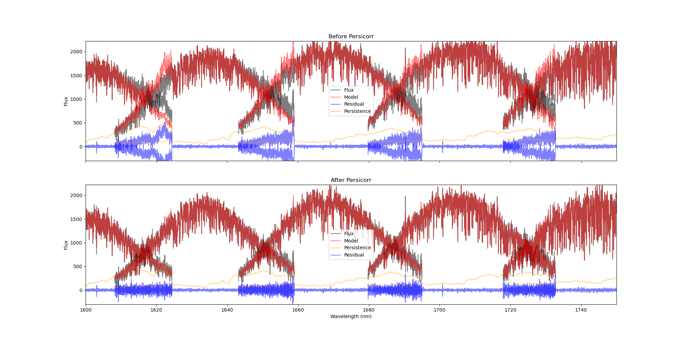

# Persicorr

Persicorr is a Python package designed to correct the persistence effect in astronomical data using a persistence map. This package reads input FITS files, processes the data to correct for persistence, and writes the corrected data back to new FITS files. It also generates plots comparing the data before and after the correction.

The code works on `e.fits` or `t.fits` or `e2ds` or `e2dsff` files (use `--mode` to tell the code which data you are starting with).

## Installation steps

### Installation of main code

There's no proper installation script yet (we're working on that). You download the Python script and call it from wherever you want to store it. If you are 100% lazy, you can just run the following command on a Linux station:

```wget -O persicorr.py https://github.com/eartigau/persitools/raw/refs/heads/main/persicorr.py```

### Getting the persifile

You will need a sample [persistence](http://www.astro.umontreal.ca/~artigau/persistence/persi.fits) file and a sample [blaze](http://www.astro.umontreal.ca/~artigau/persistence/sample_blaze.fits) file.

### Installation of dependencies

To install the required dependencies, you can use `pip`:

```bash
pip install numpy astropy matplotlib scipy bottleneck
```


## Usage

You can use the `correct_persistence` function to correct the persistence effect in your data. The function takes the path to the input FITS file and the path to the persistence map FITS file as arguments.
or use the `main` function to wrap around a set of files.


### Command-Line Interface

You can also use the command-line interface to process multiple files:

```bash
python persicorr.py <input_fits_file> --persifile <persistence_map_fits_file>
```

### Example

```bash
python persicorr.py data.fits --persifile persi.fits
```

The arguments are as follows:

```bash
usage: persicorr.py [-h] [--persifile PERSIFILE] [--doplot DOPLOT] [--mode {t.fits,e.fits,e2ds,e2dsff}] [--calibdir CALIBDIR]
                    [--replace REPLACE]
                    filenames [filenames ...]

Correct persistence in astronomical data using a persistence map.

positional arguments:
  filenames             The path(s) to the input FITS file(s) containing the data to be corrected.

optional arguments:
  -h, --help            show this help message and exit
  --persifile PERSIFILE
                        The path to the persistence map FITS file (default: 'persi.fits').
  --doplot DOPLOT       Whether to do the plotting.
  --mode {t.fits,e.fits,e2ds,e2dsff}
                        Which type of input data are you supplying [t.fits, e.fits, e2ds or e2dsff]
  --calibdir CALIBDIR   If --mode is e2ds or e2dsff you must provide the path to the calibration directory containing the blaze and
                        wavesolution
  --replace REPLACE     If True replaces the files, if False creates a new copy with _persicorr on the end

```


## Output
One you have run the commant, you will get a fits file with the same name as the original file with a `_perscorr` suffix (`2438525t.fits` becomes `2438525t_persicorr.fits`). There is also a figure (`2438525t_persicorr.png` in this case) that illustrates the residual between the s1d projection before and after the correction.




## Functions

### `write_t(data, file)`

Writes a dictionary of data to a Multi-Extension FITS (MEF) file.

### `read_t(file)`

Reads a Multi-Extension FITS (MEF) file and creates a dictionary containing all the extensions and their headers.

### `mk_wave_grid(wave1, wave2, step=1000)`

Creates a 1D wavelength grid with a step of 1 km/s.

### `mk1d(wave2d, sp2d, wave1d)`

Creates a 1D version of the 2D spectrum data by interpolating onto a 1D wavelength grid.

### `bin100(map2d)`

Bins all pixels in the 2D map along the first axis by 100 pixels.

### `correct_persistence(filename, path_to_persifile='persi.fits')`

Corrects the persistence effect in astronomical data by using a persistence map.


